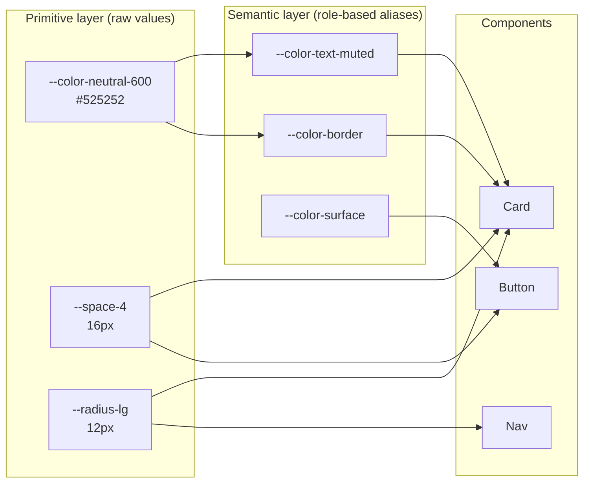
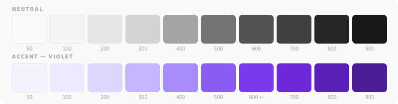
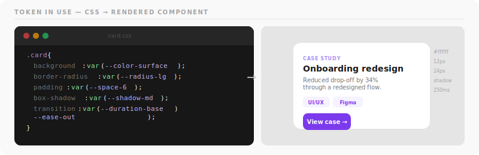
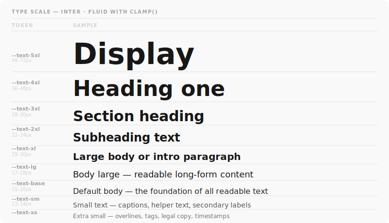
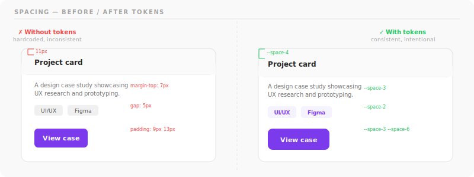
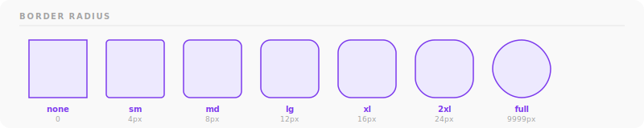
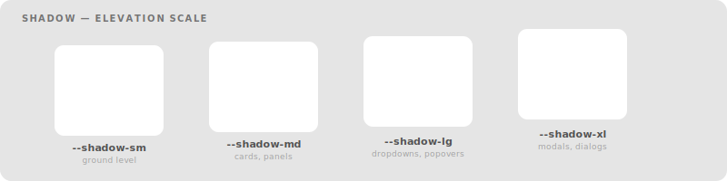
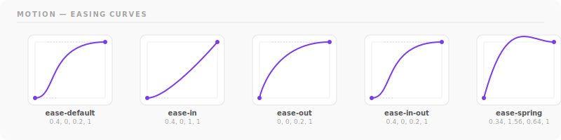

# Design Token System


A decision-based token architecture for consistent UI across projects — covering color, typography, spacing, elevation, and motion. Built as a living reference that scales from a single page to a full product suite.

> **Why tokens instead of hardcoded values?**
> When a value has a name, it can be changed in one place and updated everywhere. Tokens make design decisions explicit, auditable, and transferable between tools — from Figma variables to CSS custom properties to any future format.

---

## Token architecture

Tokens are organized in two layers:



| Layer | Purpose | Example |
|-------|---------|---------|
| **Primitive** | Raw values with no semantic meaning | `--color-neutral-600`, `--space-4` |
| **Semantic** | Named by role, mapped to primitives | `--color-text-muted`, `--color-border` |

Semantic tokens are what you use in components. Primitive tokens are what you change when rebranding. This separation means you can swap an entire color palette without touching a single component file.

---

## Color palette



The `600` step is the default brand accent — contrast-checked against white for WCAG AA compliance.

---

## Token categories

| Category | Tokens | Description |
|----------|--------|-------------|
| **Color** | Neutral scale (50–900), Accent scale (50–900), Semantic aliases, Status | Full palette with role-based aliases |
| **Typography** | Type scale (xs–5xl), Weight, Line height, Letter spacing, Font families | Fluid sizing via `clamp()` — no media queries needed |
| **Spacing** | 13-step scale on a 4px base (4px → 128px) | Consistent rhythm across all layout and components |
| **Border radius** | 7 steps (none → full) | From sharp to pill |
| **Shadows** | sm, md, lg, xl, inner | Layered box-shadows for realistic depth |
| **Motion** | 5 durations (0ms → 600ms), 5 easing curves | Named after intent, not timing |
| **Z-index** | 7 named layers (base → toast) | Eliminates z-index wars |

---

## Usage

### Import

```css
/* Remote (always latest) */
@import url('https://raw.githubusercontent.com/antoinette-nguyen/design-token-system/main/tokens.css');

/* Local copy (recommended for production) */
@import url('./tokens.css');
```

### In practice

Tokens map directly to design decisions. When you write `var(--shadow-md)`, you're not remembering a box-shadow value — you're communicating *elevation intent*.

```css
/* ✗ Avoid — hardcoded values are opaque and brittle */
.card {
  background: #ffffff;
  border-radius: 12px;
  padding: 24px;
  box-shadow: 0 4px 12px rgba(0,0,0,0.08);
}

/* ✓ Prefer — tokens are self-documenting */
.card {
  background: var(--color-surface);
  border-radius: var(--radius-lg);
  padding: var(--space-6);
  box-shadow: var(--shadow-md);
  transition: box-shadow var(--duration-base) var(--ease-out);
}
```



### Motion with intent

```css
/* Micro-interactions: UI feedback (hover, active) */
transition: background var(--duration-fast) var(--ease-out);

/* Standard transitions: panels, modals, dropdowns */
transition: transform var(--duration-base) var(--ease-default);

/* Expressive moments: page transitions, onboarding */
transition: opacity var(--duration-slow) var(--ease-in-out);
```

---

## Visual reference

Open `index.html` in a browser to explore all tokens interactively:

- Color swatches — click any to copy the `var()` expression
- Live type scale with sample text at every step
- Spacing bars, radius shapes, shadow depths, and motion previews

### Type scale



All sizes use `clamp(min, preferred-vw, max)` — fluid between viewport sizes without breakpoints.

### Spacing



Every spacing value is a multiple of 4px. Adjacent steps feel visually related; skipping steps creates intentional hierarchy.

### Border radius



### Shadow elevation



Each shadow level maps to a UI role: `sm` for resting state, `md` for cards, `lg` for dropdowns, `xl` for modals.

### Motion — easing curves



`ease-spring` (rightmost) uses a `cubic-bezier` with a y-value above 1, producing a subtle overshoot — use for interactive elements that should feel physical, not mechanical.

---

## Design decisions

**Why violet as the accent?**
Violet sits in a frequency range that reads as intentional and modern without the aggression of red or the genericness of blue. It contrasts cleanly against neutral-900 text on light backgrounds and neutral-50 on dark.

**Why `clamp()` for type?**
Fluid type scales eliminate the need for breakpoint-specific font-size overrides. The heading size responds to viewport width continuously — no jarring jumps, no extra media queries to maintain.

**Why a 4px spacing base?**
4px (0.25rem) aligns with most browser default font metrics and produces a scale where adjacent steps feel visually related. Every value is divisible by 4, which maps cleanly to common display densities.

---

## Figma

> Coming in Phase 2 — the Figma Variables panel will be connected to this token system via Tokens Studio, enabling a two-way sync between design and code.

A screenshot of the Figma Variables panel showing token connections will be added here once the pipeline is live.

---

## Roadmap

- [ ] Export tokens as JSON for Figma Variables / Tokens Studio sync
- [ ] Add dark mode semantic layer (`[data-theme="dark"]` overrides)
- [ ] Add `tokens.js` ESM export for use in JS/TS projects
- [ ] Set up Style Dictionary pipeline for multi-platform output
- [ ] Connect Figma Variables → tokens.css via automated pipeline

---

*Part of a 9-month UI/UX portfolio build — [view all repos](https://github.com/antoinette-nguyen)*
